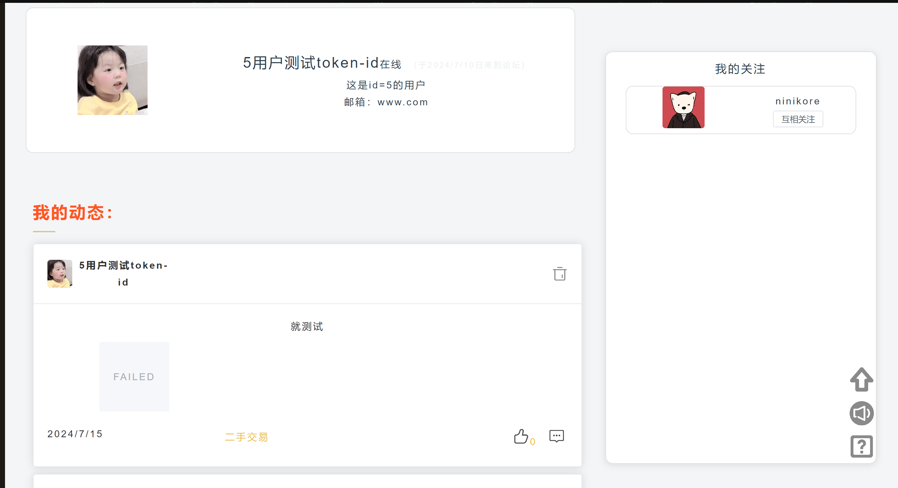
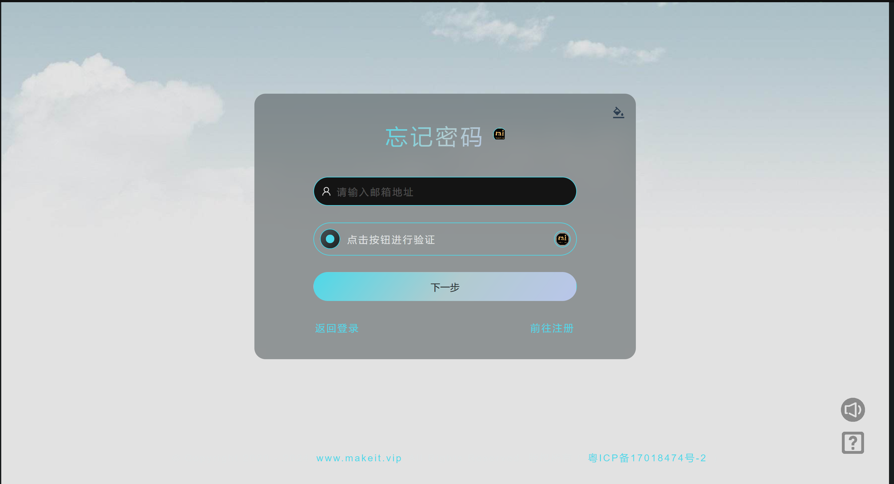
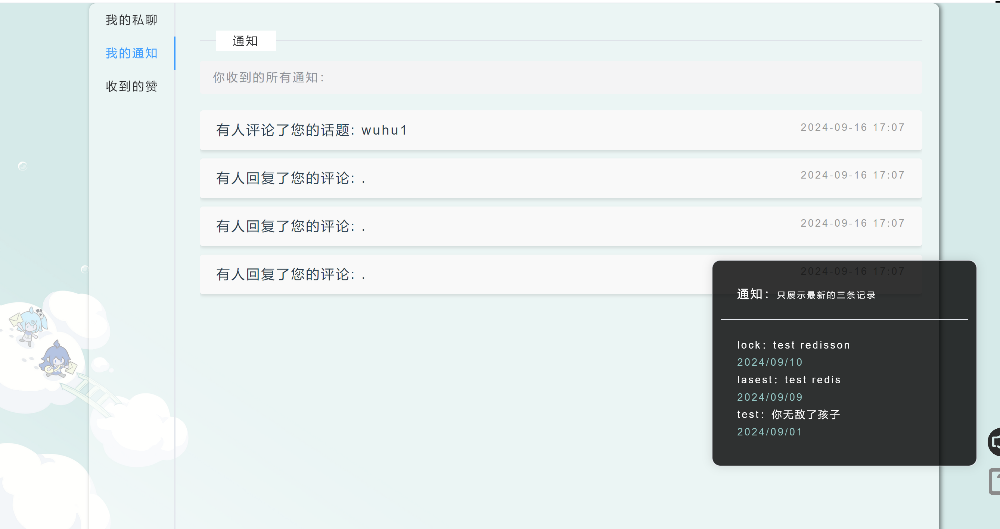
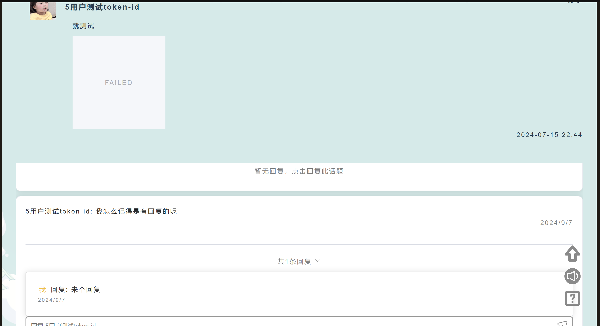
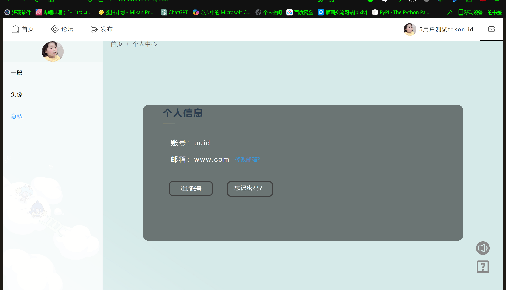
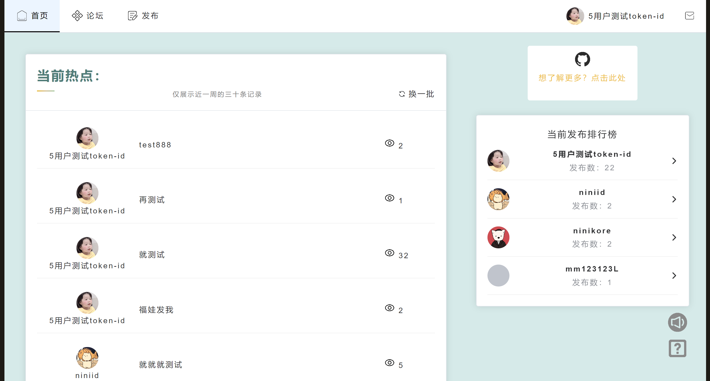

# forum-frontend

This template should help get you started developing with Vue 3 in Vite.

**后端项目源码地址**: [forum-backend](https://github.com/hufaei/forum-backend)
```
└─src                              // 项目的源代码目录
    ├─assets                       // 静态资源文件（如图片、字体等）
    ├─components                   // 组件
    │  ├─form                      // 表单组件（处理用户个人中心的三个表单组件）
    │  └─message                   // 消息组件（用于显示聊天或者通知页面元素）
    ├─requestMethod                // 请求方法模块（UI框架二次封装axios API ）
    ├─router                       // 路由配置（定义前端页面的路由，Vue Router）
    ├─stores                       // 状态管理（管理应用的全局状态，pinia）
    │  └─app                       
    ├─utils                        // 工具类函数（封装常用的工具方法，时间戳处理、数据请求体）
    └─views                        // 视图文件（页面组件，通常是路由对应的页面）

```
---
* _项目开发规范详解见：_ [项目开发规范](https://github.com/hufaei/forum--template/docx "开发规范")
    * [前端开发规范](docx/前端命名规范.txt)
    * [后端开发规范](docx/后端开发规范.txt)
    * [Api命名规范](docx/api命名规范.txt)


---
## 使用须知：
***下载包后先修改main.ts文件下goeasy的appkey（若无自行申请）--[GoEasy](https://console.goeasy.io/#/application)***<br>
***<h6>写的时候为了测试用法，一部分的通知发送配合监听消息队列写道后端去了，故修改后端代码对应的controller层的MqListener文件</h6>***<br>
***<h6>此文件只针对前端的部署，后端的部署使用详见其README.md文件</h6>***
## 注意事项
在私聊页面（MessageView）要发送语音、视频和图片，请先**配置第三方存储服务**：
* [阿里云OSS对象存储集成指南](https://docs.goeasy.io/2.x/im/message/media/alioss)
* [腾讯云COS对象存储集成指南](https://docs.goeasy.io/2.x/im/message/media/tencentcos)
---
## 预览图
### 用户中心：

### 登录注册模板：

### 通知页面：

### 话题页面：

### 账号设置：

### 首页：

---

## Type Support for `.vue` Imports in TS

TypeScript cannot handle type information for `.vue` imports by default, so we replace the `tsc` CLI with `vue-tsc` for type checking. In editors, we need [Volar](https://marketplace.visualstudio.com/items?itemName=Vue.volar) to make the TypeScript language service aware of `.vue` types.

## Customize configuration

See [Vite Configuration Reference](https://vitejs.dev/config/).

---
<h6>若使用yarn或者pnpm下载依赖，请只使用一种下载依赖的工具，若报错或者失败需要切换下载命令，需要自行删除之前使用命令产生的各种文件</h6>

## Project Setup

```sh
npm install
```

### Compile and Hot-Reload for Development

```sh
npm run dev
```

### Type-Check, Compile and Minify for Production

```sh
npm run build
```

### Lint with [ESLint](https://eslint.org/)

```sh
npm run lint
```
## 致谢

本项目参考并使用了以下开源仓库的组件：

- [miitvip-vue-admin-manager](https://github.com/lirongtong/miitvip-vue-admin-manager "Vue 3 管理后台模板") 。
最后以防万一有人没看见项目侧边栏试用网站：[预览网站](http://47.108.166.11/)
当然不会一直开着吧。。。服务器也要捣鼓，访问不成功就择日吧
